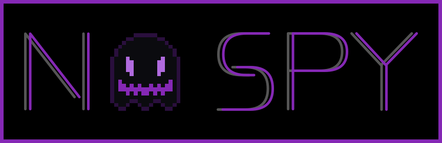
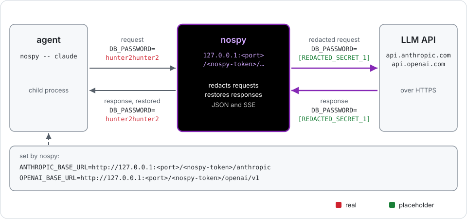
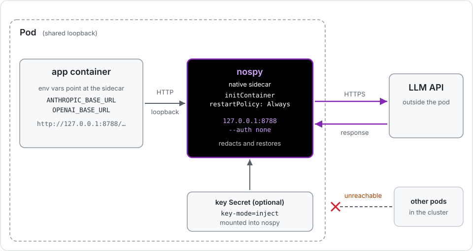
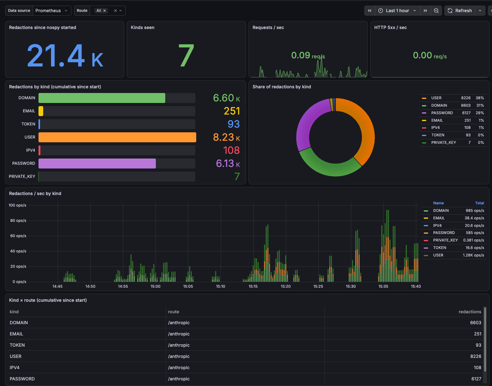

# nospy



`nospy` is a forward proxy that sits between an AI agent and its API. It swaps secrets and personal data in your requests for placeholders, and puts the values back in the response. 


## Architecture overview

### Wrap mode



`nospy` starts a proxy on a random local port and runs your agent with its base URL pointed at the proxy. See [Wrap mode](docs/wrap.md).

```bash
nospy -- claude
```

### Serve mode


`nospy serve` runs as a long-lived proxy for several clients, each authenticated by `--auth` and serving routes listed with `--route`. `Container` and `Kubernetes` modes run via `serve` . See [Serve mode](docs/serve.md).

```bash
nospy serve --auth none --listen 127.0.0.1:8788 --route /anthropic=https://api.anthropic.com
```

### Kubernetes sidecar



`nospy` runs next to your app in the same pod as a sidecar. See [Kubernetes](docs/kubernetes.md#sidecar).

### Kubernetes shared Service


Each client is assigned to one replica (the "owner"), which holds its conversation state. If a request is sent to another replica, that replica checks and forwards it to the owner. See [Kubernetes](docs/kubernetes.md#shared-service) and [multiple replicas](docs/serve.md#multiple-replicas).

## Pick a mode

| Mode | Use it to | Example |
|---|---|---|
| [Wrap](docs/wrap.md) | Run one agent on your machine behind `nospy` | `nospy -- claude` |
| [Scan](docs/scan.md) | Redact a file or text and print the result | `nospy scan notes.md` |
| [Serve](docs/serve.md) | Run as proxy | `nospy serve --auth none --provider ollama` |
| [Container](docs/container.md) | Run `serve` in Podman | `podman run ... nospy:dev` |
| [Kubernetes](docs/kubernetes.md) | Run `serve` as a sidecar or shared Service | `helm install nospy deploy/helm/nospy` |


## Dashboard



`nospy` exposes [Prometheus metrics](docs/metrics.md), including `nospy_redactions_total` by route and kind (`EMAIL`, `TOKEN`, etc...). 

Get the Grafana dashboard here: [nospy-redactions.json](deploy/grafana/nospy-redactions.json).

## Install

Download a binary from the [releases page](../../releases), and check it against `SHA256SUMS` (each file also has a build provenance attestation: `gh attestation verify <file> --repo 6fears7/nospy-ai`). 

### MacOS
The macOS binaries are not signed at this time. You will need to clear the quarantine flag after download to run the app: `xattr -d com.apple.quarantine nospy`. 

To pull the container image / Helm chart:

```
podman pull ghcr.io/6fears7/nospy-ai:<version>
helm install nospy oci://ghcr.io/6fears7/charts/nospy-ai --version <version>
```

To build from source, you need Go 1.27 (standard library only).

```
go build -o nospy ./cmd/nospy      # or: go install ./cmd/nospy
```


## More documentation

- [How it works](docs/how-it-works.md): placeholders, detection, remembered values
- [Custom terms](docs/custom-terms.md): adding personal words and patterns
- [Metrics](docs/metrics.md): Prometheus metrics
- [Commands](docs/commands.md): all `nospy` commands
- [Known limitations](docs/limitations.md)

## Contributing

See [CONTRIBUTING.md](CONTRIBUTING.md).

## License

[MIT](LICENSE)
